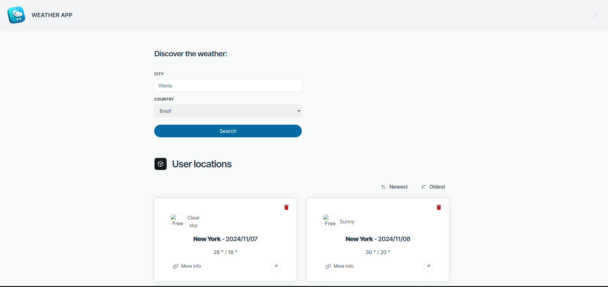

<!-- PROJECT LOGO -->

# The Weather App

<p align="center">
  The Weather App is a web application designed to provide users with accurate and up-to-date weather information. Users can search for the current weather and forecast for any city worldwide. The application integrates with the OpenWeatherMap API to fetch weather data and displays it in a user-friendly interface.
  
</p>

## Technologies used


## About The Project

Key features of the Weather App include:

-   Real-time weather updates
-   5-day weather forecast
-   Search functionality for cities worldwide
-   Responsive design for optimal viewing on different devices

The project is built using modern web technologies and follows best practices for performance and maintainability.

An example of call to get the weather for London is http://api.openweathermap.org/data/2.5/forecast?q=London,uk&APPID=YOUR_API_KEY

<p align="right">(<a href="#readme-top">back to top</a>)</p>

### Prerequisites

This is an example of how to list things you need to use the software and how to install them.

-   npm 6.14
-   node 16.10
-   yarn 1.22
-   Laravel 11
-   PHP 8.2

### Installation

1. Clone the repo
    ```sh
    git clone https://github.com/andreattamatheus/turnoWeatherApp
    ```
2. Install NPM packages

## Project API

Copy the .env-example and rename it to .env

Inside the .env file, you must filled the correct info about your DB.

-   DB_HOST=127.0.0.1
-   DB_PORT=3306
-   DB_DATABASE=YOUR_DATABASE
-   DB_USERNAME=YOUR_USERNAME
-   DB_PASSWORD=YOUR_PASSWORD

Also, since it has an integration service, you need to fill the:

-   OPENWEATHER_API_KEY with the key generated in openweathermap
-   OPENWEATHER_API_URL can be kept the same.

```
composer install
```

```
php artisan optimize
```

Two users will be created here: backoffice@yopmail.com and admin@yopmail.com. Both have the password _123123123_

```
php artisan migrate:fresh --seed
```

```
php artisan serve
```

### Pint

```
 ./vendor/bin/pint
```

### PHPStan

```
 ./vendor/bin/phpstan analyse
```

### Test

```
php artisan test
```

### Delete job

You can check the schedules jobs:

```
php artisan schedule:list
```

If you want to run the command to delete locations older than 3 days, you can try:

```
php artisan schedule:run
```

Then run:

```
php artisan queue:listen
```

## Project Frontend

You can access the system with backoffice@yopmail.com and admin@yopmail.com. Both have the password _123123123_

Project has only two pages in the frontend: the /login and /home.

Needs to add to .env the URL to the api. For this test, it's http://localhost:8000/api/

The frontend is inside the folder resources/js/app.

```
yarn
```

```
yarn run serve
```

### Compiles and minifies for production

```
yarn run build
```

### Lints and fixes files

```
yarn run lint
```

<p align="right">(<a href="#readme-top">back to top</a>)</p>

## Contact

Matheus - [@andreattamatheus](https://github.com/andreattamatheus)

Project Link: [https://github.com/andreattamatheus/turnoWeatherApp](https://github.com/andreattamatheus/turnoWeatherApp)

<p align="right">(<a href="#readme-top">back to top</a>)</p>

<!-- MARKDOWN LINKS & IMAGES -->
<!-- https://www.markdownguide.org/basic-syntax/#reference-style-links -->

[contributors-shield]: https://img.shields.io/github/contributors/andreattamatheus/the-todo-app.svg?style=for-the-badge
[contributors-url]: https://github.com/andreattamatheus/the-todo-app/graphs/contributors
[forks-shield]: https://img.shields.io/github/forks/andreattamatheus/the-todo-app.svg?style=for-the-badge
[forks-url]: https://github.com/andreattamatheus/the-todo-app/network/members
[stars-shield]: https://img.shields.io/github/stars/andreattamatheus/the-todo-app.svg?style=for-the-badge
[stars-url]: https://github.com/andreattamatheus/the-todo-app/stargazers
[issues-shield]: https://img.shields.io/github/issues/andreattamatheus/the-todo-app.svg?style=for-the-badge
[issues-url]: https://github.com/andreattamatheus/the-todo-app/issues
[license-shield]: https://img.shields.io/github/license/andreattamatheus/the-todo-app.svg?style=for-the-badge
[license-url]: https://github.com/andreattamatheus/the-todo-app/blob/master/LICENSE.txt
[linkedin-shield]: https://img.shields.io/badge/-LinkedIn-black.svg?style=for-the-badge&logo=linkedin&colorB=555
[linkedin-url]: https://linkedin.com/in/othneildrew
[product-screenshot]: images/screenshot.png
[Next.js]: https://img.shields.io/badge/next.js-000000?style=for-the-badge&logo=nextdotjs&logoColor=white
[Next-url]: https://nextjs.org/
[React.js]: https://img.shields.io/badge/React-20232A?style=for-the-badge&logo=react&logoColor=61DAFB
[React-url]: https://reactjs.org/
[Vue.js]: https://img.shields.io/badge/Vue.js-35495E?style=for-the-badge&logo=vuedotjs&logoColor=4FC08D
[Vue-url]: https://vuejs.org/
[Angular.io]: https://img.shields.io/badge/Angular-DD0031?style=for-the-badge&logo=angular&logoColor=white
[Angular-url]: https://angular.io/
[Svelte.dev]: https://img.shields.io/badge/Svelte-4A4A55?style=for-the-badge&logo=svelte&logoColor=FF3E00
[Svelte-url]: https://svelte.dev/
[Laravel.com]: https://img.shields.io/badge/Laravel-FF2D20?style=for-the-badge&logo=laravel&logoColor=white
[Laravel-url]: https://laravel.com
[Bootstrap.com]: https://img.shields.io/badge/Bootstrap-563D7C?style=for-the-badge&logo=bootstrap&logoColor=white
[Bootstrap-url]: https://getbootstrap.com
[JQuery.com]: https://img.shields.io/badge/jQuery-0769AD?style=for-the-badge&logo=jquery&logoColor=white
[JQuery-url]: https://jquery.com
